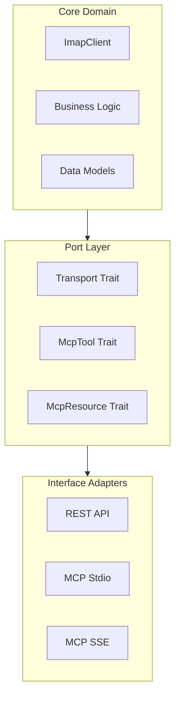

# Unified REST + MCP Server Implementation Plan

## **Status:** DRAFT 3  
## **Date:** 2024-04-06

## **Objective**

Implement a unified, modular codebase that supports three distinct interfaces:
1. REST API (Implemented)
2. MCP stdio server (Planned)
3. MCP SSE server (Planned)

All sharing the same core IMAP + business logic, with comprehensive testing.

## **Architecture Overview**



## **File Structure**
```
src/
├── bin/
│   └── rustymail.rs          # Main executable
├── api/
│   ├── rest.rs               # REST adapter
│   ├── rest_test.rs          # REST tests
│   ├── mcp.rs               # MCP adapter
│   ├── mcp_test.rs          # MCP tests
│   ├── sse.rs               # SSE adapter
│   ├── sse_test.rs          # SSE tests
│   └── mod.rs               # API module definitions
├── imap/                    # Core Domain
│   ├── client.rs           # IMAP client implementation
│   ├── client_test.rs      # IMAP client tests
│   └── mod.rs             
├── transport.rs            # Port definitions
├── transport_test.rs       # Transport tests
├── config.rs               # Configuration
├── config_test.rs          # Configuration tests
└── lib.rs                  # Library exports
```

## **Implementation Phases**

### Phase 0: Code Refactoring (2-3 days)
- [ ] Create new directory structure
- [ ] Move and split existing code:
  ```rust
  // Example transport.rs port definition
  #[async_trait]
  pub trait Transport {
      async fn send(&self, message: Message) -> Result<(), Error>;
      async fn receive(&self) -> Result<Message, Error>;
  }

  // Example api/rest.rs adapter
  pub struct RestAdapter {
      imap_client: Arc<ImapClient>,
      config: RestConfig,
  }
  ```
- [ ] Reorganize tests alongside implementation files
- [ ] Update imports and module declarations
- [ ] Verify existing functionality

### Phase 1: Core Domain Enhancement (2-3 days)
- [ ] Refine IMAP client interface
  ```rust
  pub struct ImapClient {
      session: Arc<dyn ImapSession>,
      config: ImapConfig,
  }

  impl ImapClient {
      pub async fn list_folders(&self) -> Result<Vec<Folder>, Error>;
      pub async fn get_email(&self, uid: &str) -> Result<Email, Error>;
      // ... other core operations
  }
  ```
- [ ] Implement domain models
- [ ] Add error types
- [ ] Set up logging

### Phase 2: Port Layer Implementation (2-3 days)
- [ ] Define transport traits
- [ ] Create MCP protocol interfaces
  ```rust
  pub trait McpTool {
      async fn execute(&self, params: Value) -> Result<Value, Error>;
      fn name(&self) -> &str;
  }

  pub trait McpResource {
      async fn read(&self) -> Result<Value, Error>;
      fn name(&self) -> &str;
  }
  ```
- [ ] Implement error handling
- [ ] Add capability negotiation

### Phase 3: REST Adapter Enhancement (2-3 days)
- [ ] Update REST implementation to use new architecture
- [ ] Implement transport layer
- [ ] Add authentication
- [ ] Update documentation

### Phase 4: MCP Stdio Adapter (2-3 days)
- [ ] Implement stdio transport
  ```rust
  pub struct StdioTransport {
      reader: BufReader<Stdin>,
      writer: BufWriter<Stdout>,
  }
  ```
- [ ] Add message serialization
- [ ] Implement command routing
- [ ] Add error handling

### Phase 5: MCP SSE Adapter (2-3 days)
- [ ] Implement SSE transport
  ```rust
  pub struct SseTransport {
      clients: Arc<RwLock<HashMap<String, Sender<Event>>>>,
  }
  ```
- [ ] Add client management
- [ ] Handle streaming
- [ ] Implement heartbeat

### Phase 6: Testing & Integration (2-3 days)
- [ ] Unit tests for each component
- [ ] Integration tests
- [ ] Performance benchmarks
- [ ] Cross-interface testing

## **Core Components**

### Transport Layer
```rust
#[async_trait]
pub trait Transport {
    async fn send(&self, msg: Message) -> Result<(), Error>;
    async fn receive(&self) -> Result<Message, Error>;
    async fn close(&self) -> Result<(), Error>;
}
```

### Configuration
```rust
#[derive(Debug, Deserialize)]
pub struct Config {
    pub interface: Interface,
    pub imap: ImapConfig,
    pub rest: Option<RestConfig>,
    pub sse: Option<SseConfig>,
}

#[derive(Debug, Deserialize)]
pub enum Interface {
    Rest,
    Stdio,
    Sse,
}
```

### Error Handling
```rust
#[derive(Debug, Error)]
pub enum Error {
    #[error("Transport error: {0}")]
    Transport(String),
    #[error("IMAP error: {0}")]
    Imap(String),
    #[error("Protocol error: {0}")]
    Protocol(String),
}
```

## **Testing Strategy**

1. Unit Tests (alongside implementation)
   - Core domain logic
   - Port implementations
   - Adapter functionality

2. Integration Tests
   - End-to-end flows
   - Cross-interface testing
   - Error scenarios

3. Performance Tests
   - Throughput
   - Latency
   - Resource usage

## **Security Considerations**

1. Authentication per Interface
   - REST: HTTP Basic/Bearer
   - MCP: Capability-based
   - SSE: Token-based

2. Transport Security
   - TLS for network protocols
   - Process isolation for stdio

## **Timeline**

1. Code Refactoring: 2-3 days
2. Core Domain Enhancement: 2-3 days
3. Port Layer Implementation: 2-3 days
4. REST Adapter Enhancement: 2-3 days
5. MCP Stdio Adapter: 2-3 days
6. MCP SSE Adapter: 2-3 days
7. Testing & Integration: 2-3 days

Total: ~14-21 days

## **Dependencies**

```toml
[dependencies]
tokio = { version = "1.28", features = ["full"] }
actix-web = "4.3"
serde = { version = "1.0", features = ["derive"] }
async-trait = "0.1"
thiserror = "1.0"
tracing = "0.1"

# Interface-specific
jsonrpc-core = "18.0"
futures = "0.3"
tokio-util = { version = "0.7", features = ["codec"] }
```

## **Monitoring**

1. Common Metrics
   - Operation latency
   - Error rates
   - Connection status

2. Interface-specific Metrics
   - REST: HTTP metrics
   - Stdio: Process stats
   - SSE: Connection counts

## **Documentation**

1. Architecture Guide
   - Core domain overview
   - Port interfaces
   - Adapter implementations

2. Interface Documentation
   - REST API endpoints
   - MCP protocol spec
   - SSE events guide

3. Development Guide
   - Setup instructions
   - Testing procedures
   - Deployment options 