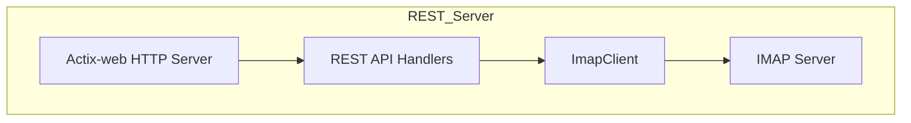
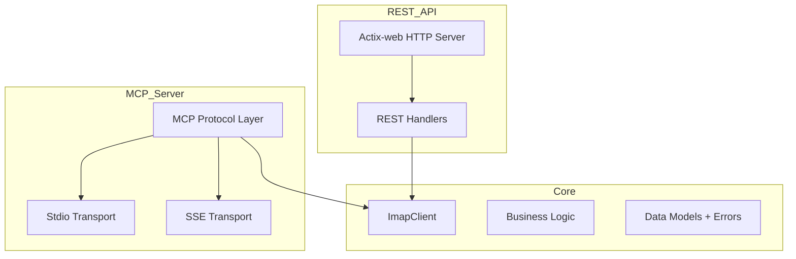

# MCP + REST Unified Server Refactor Plan (DRAFT 1)

---

## **Status:** DRAFT 1  
## **Date:** 2025-04-05

---

## **Objective**

Refactor the existing Rust REST IMAP API into a **unified, modular codebase** that supports:

- Existing **REST API**
- **MCP stdio server** (local CLI integration)
- **MCP SSE server** (HTTP + Server-Sent Events)

All sharing the **same core IMAP + business logic**, with **test-driven development** and **integration tests without mocks**.

---

## **Current Architecture**

---

## **Target Architecture**

---

## **Implementation Checklist**

### **Core Extraction**

- [ ] Extract `ImapClient<S>` and business logic into a `core` module/crate
- [ ] Include data models and error types
- [ ] Remove any HTTP or transport-specific code from core

### **REST API**

- [ ] Refactor existing REST API to depend on `core`
- [ ] Keep REST handlers thin
- [ ] Use shared data models and errors

### **MCP Server**

- [ ] Implement MCP protocol in Rust:
  - [ ] **Initialization** and **capability negotiation**
  - [ ] **JSON-RPC 2.0** message framing
- [ ] **Stdio transport**:
  - [ ] Read/write JSON-RPC over stdin/stdout
- [ ] **SSE transport**:
  - [ ] HTTP POST for client-to-server
  - [ ] Server-Sent Events for server-to-client
- [ ] Expose **core logic** as:
  - [ ] **MCP Tools** (e.g., list folders, fetch email, move email)
  - [ ] **MCP Resources** (e.g., email content, folder lists)
  - [ ] **MCP Prompts** (optional, e.g., compose email templates)
- [ ] Map errors to MCP error codes

### **Startup**

- [ ] Optionally, create **separate binaries** for REST and MCP servers
- [ ] Or a **single binary** with CLI flags to select mode
- [ ] Both use the same `core`

### **Testing (Test-Driven Development)**

- [ ] **Unit tests** for core logic
- [ ] **Integration tests**:
  - [ ] REST API end-to-end (no mocks)
  - [ ] MCP stdio server end-to-end (no mocks)
  - [ ] MCP SSE server end-to-end (no mocks)
- [ ] **Cross-interface tests** for consistency
- [ ] **Performance tests**
- [ ] **Security tests**

### **Documentation**

- [ ] Update API docs
- [ ] Document MCP tools/resources/prompts
- [ ] Developer setup instructions

---

## **Testing Plan**

### **Unit Tests**

- IMAP client behaviors
- Business logic correctness
- Error conditions

### **Integration Tests**

- REST API with real IMAP server
- MCP stdio server with real IMAP server
- MCP SSE server with real IMAP server

### **Cross-Interface Tests**

- Consistency of results across REST and MCP
- Error propagation

### **Performance Tests**

- Latency and throughput benchmarks

### **Security Tests**

- Authentication/authorization (if applicable)
- Input validation
- Error leakage

---

## **MCP Protocol Integration Notes**

- **Transports**:
  - **Stdio**: JSON-RPC 2.0 over stdin/stdout
  - **SSE**: HTTP POST + Server-Sent Events
- **Capabilities**:
  - Tools
  - Resources
  - (Optional) Prompts
- **Message Types**:
  - Requests, responses, notifications
- **Error Handling**:
  - Use MCP error codes
  - Provide helpful messages
- **Initialization**:
  - Version negotiation
  - Capability declaration

---

## **Migration Considerations**

- Existing REST API clients should remain compatible
- New MCP clients can connect via stdio or SSE
- Gradual migration possible
- No breaking changes to core IMAP logic
- Tests must cover all interfaces

---

## **Open Questions**

- Should REST and MCP servers be **separate binaries** or **configurable modes** in one binary?
- Any **authentication/authorization** requirements for MCP servers?
- Which **MCP features** beyond tools/resources are required? (e.g., prompts, sampling)
- Any **rate limiting** or **security constraints**?
- Preferred **error reporting format** for MCP clients?

---

## **Summary**

This plan enables a **modular, testable, and extensible** Rust codebase supporting:

- REST API (existing)
- MCP stdio server
- MCP SSE server

All sharing a **single core logic layer**, with **test-driven development** and **integration tests without mocks**.

---

# END OF DRAFT 1
