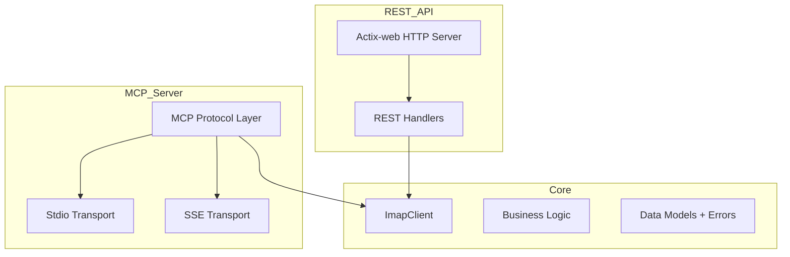

# RustyMail System Documentation

## Project Overview

RustyMail is a high-performance IMAP API server written in Rust that provides multiple interface options:
- REST API (implemented)
- MCP stdio server (planned)
- MCP SSE server (planned)

## Directory Structure

```
rustymail/
├── core/                     # Core IMAP and business logic
│   ├── src/
│   │   ├── imap/           # IMAP client implementation
│   │   ├── models/         # Shared data models
│   │   ├── utils/          # Helper functions
│   │   ├── lib.rs          # Core library entry point
│   │   └── error.rs        # Error definitions
│   └── Cargo.toml          # Core dependencies
├── imap-api-rust/           # REST API implementation
│   ├── src/
│   │   ├── api/            # REST API endpoints
│   │   ├── models/         # API-specific models
│   │   └── main.rs         # REST server entry point
│   ├── tests/
│   │   ├── integration/    # Integration tests
│   │   ├── unit_tests/     # Unit tests
│   │   ├── mcp_stdio.rs    # MCP stdio tests (planned)
│   │   └── mcp_sse.rs      # MCP SSE tests (planned)
│   ├── benches/            # Performance benchmarks
│   └── Cargo.toml          # API dependencies
├── docs/                    # Documentation
├── config/                  # Configuration files
└── templates/               # HTML templates

## Key Components

### 1. Core Library (`core/`)

#### IMAP Client (`core/src/imap/`)
- Implements IMAP protocol interactions
- Provides async trait-based interface
- Handles connection pooling and reconnection
- Supports TLS for secure communication

Key traits and types:
```rust
#[async_trait]
pub trait ImapSessionTrait: Send + Sync {
    async fn list(&self) -> Result<ZeroCopy<Vec<String>>, ImapClientError>;
    async fn create(&self, name: &str) -> Result<(), ImapClientError>;
    async fn delete(&self, name: &str) -> Result<(), ImapClientError>;
    // ... other IMAP operations
}

pub struct ImapClient<S: ImapSessionTrait> {
    session: S,
}
```

#### Models (`core/src/models/`)
- Configuration structures
- Shared data types
- Error definitions

### 2. REST API (`imap-api-rust/`)

#### API Endpoints (`imap-api-rust/src/api/`)
- Folder management (list, create, delete, rename)
- Email operations (list, fetch, search, move)
- Statistics and monitoring
- Documentation endpoints

#### Server Configuration
```rust
#[derive(Debug, Deserialize, Clone)]
pub struct AppConfig {
    pub imap: ImapConfig,
    pub server: ServerConfig,
    pub log_level: String,
}
```

### 3. MCP Server (Planned)

#### Stdio Transport
- JSON-RPC 2.0 over stdin/stdout
- Local CLI integration
- Synchronous command execution

#### SSE Transport
- HTTP POST for client requests
- Server-Sent Events for responses
- Streaming capabilities

## Key Dependencies

### Core Dependencies
- `imap`: IMAP protocol implementation (v2.4.1)
- `native-tls`: TLS support (v0.2.11)
- `tokio`: Async runtime (v1.28.2)
- `serde`: Serialization (v1.0.164)
- `async-trait`: Async trait support (v0.1.77)

### API Dependencies
- `actix-web`: Web framework (v4.3.1)
- `mail-parser`: Email parsing (v0.9.1)
- `lettre`: Email handling (v0.10.4)
- `tracing`: Logging (v0.1.37)
- `tera`: HTML templating (v1.19.0)

## Testing Infrastructure

### Unit Tests
- Mock implementations for IMAP client
- Isolated component testing
- Error handling verification

### Integration Tests
- Real IMAP server testing
- End-to-end API testing
- Performance benchmarks

### Benchmark Results
```
folder_operations/list_folders    time: [472.50 ms 554.99 ms 663.12 ms]
folder_operations/folder_stats    time: [511.27 ms 686.22 ms 894.69 ms]
email_operations/list_emails     time: [496.81 ms 675.59 ms 861.86 ms]
```

## Configuration

### Environment Variables
```env
IMAP_HOST=imap.example.com
IMAP_PORT=993
IMAP_USERNAME=your_username
IMAP_PASSWORD=your_password
SERVER_HOST=0.0.0.0
SERVER_PORT=8080
LOG_LEVEL=info
```

### Configuration File (TOML)
```toml
[imap]
host = "imap.example.com"
port = 993
username = "your_username"
password = "your_password"

[server]
host = "0.0.0.0"
port = 8080

log_level = "info"
```

## Error Handling

Comprehensive error types for different failure scenarios:
```rust
#[derive(Debug, Error, Clone)]
pub enum ImapClientError {
    #[error("IMAP error: {0}")]
    ImapError(String),
    #[error("Connection error: {0}")]
    ConnectionError(String),
    #[error("TLS error: {0}")]
    TlsError(String),
    // ... other error types
}
```

## Implementation Status

### Completed
- ✅ Core IMAP functionality
- ✅ REST API implementation
- ✅ Configuration management
- ✅ Error handling
- ✅ Testing framework
- ✅ Performance benchmarks

### In Progress
- 🟡 Documentation
- 🟡 CI/CD pipeline

### Planned
- ⏳ MCP stdio server
- ⏳ MCP SSE server
- ⏳ Additional security features

## Architecture Diagram



## Performance Considerations

1. Connection Pooling
   - Reuse IMAP connections
   - Handle reconnection gracefully
   - Manage concurrent access

2. Async Operations
   - Non-blocking I/O
   - Tokio runtime for async execution
   - Efficient resource utilization

3. Memory Management
   - Zero-copy where possible
   - Efficient buffer management
   - Smart pointer usage (Arc, Mutex)

## Security Features

1. TLS Support
   - Secure IMAP connections
   - Certificate validation
   - Modern cipher suites

2. Authentication
   - IMAP authentication
   - API authentication (if configured)
   - Secure credential handling

3. Error Handling
   - Safe error propagation
   - No sensitive information leakage
   - Proper error logging

## Development Guidelines

1. Code Style
   - Follow Rust idioms
   - Use type safety features
   - Implement proper error handling
   - Document public interfaces

2. Testing
   - Write unit tests for new features
   - Add integration tests for endpoints
   - Include performance benchmarks
   - Test error conditions

3. Documentation
   - Update API documentation
   - Document configuration changes
   - Keep README current
   - Add code comments for complex logic

## Future Enhancements

1. MCP Implementation
   - Complete stdio transport
   - Implement SSE transport
   - Add streaming capabilities
   - Support all IMAP operations

2. Security
   - Add rate limiting
   - Implement request validation
   - Add audit logging
   - Support custom authentication

3. Performance
   - Optimize connection pooling
   - Add caching layer
   - Improve error handling
   - Enhance monitoring

4. Features
   - Email composition
   - Attachment handling
   - Search optimization
   - Folder synchronization 