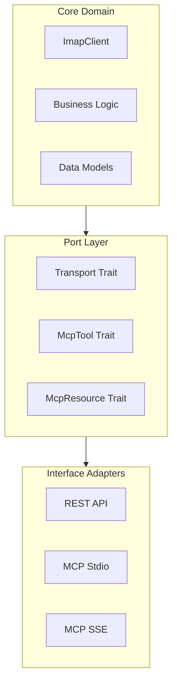

# RustyMail System Documentation

## Project Overview

RustyMail is a high-performance IMAP API server written in Rust that implements a hexagonal architecture (ports and adapters) pattern to provide multiple interface options:
- REST API (to be reimplemented)
- MCP stdio server (planned)
- MCP SSE server (planned)

## Architecture Overview

The project follows a hexagonal architecture pattern with three main layers:

1. Core Domain (IMAP client and business logic)
2. Ports (interface contracts)
3. Adapters (interface implementations)



## Directory Structure

```
rustymail/
├── src/
│   ├── api/                # Interface Adapters
│   │   ├── rest.rs        # REST API adapter
│   │   ├── rest_test.rs   # REST tests
│   │   ├── mcp.rs         # MCP adapter
│   │   ├── mcp_test.rs    # MCP tests
│   │   ├── sse.rs         # SSE adapter
│   │   └── sse_test.rs    # SSE tests
│   ├── imap/              # Core Domain
│   │   ├── client.rs      # IMAP client implementation
│   │   ├── client_test.rs # IMAP client tests
│   │   └── mod.rs         # Domain module definitions
│   ├── transport.rs       # Port definitions
│   ├── transport_test.rs  # Port tests
│   └── lib.rs             # Library exports
├── docs/                  # Documentation
└── backup/               # Legacy code backup
```

## Key Components

### 1. Transport Port (`src/transport.rs`)

The primary port defining how adapters communicate with the core domain:

```rust
#[async_trait]
pub trait Transport: Send + Sync {
    async fn send(&self, message: Message) -> Result<(), TransportError>;
    async fn receive(&self) -> Result<Message, TransportError>;
    async fn close(&self) -> Result<(), TransportError>;
    async fn is_connected(&self) -> bool;
}

pub struct Message {
    pub id: Option<String>,
    pub kind: MessageKind,
    pub payload: serde_json::Value,
}

pub enum MessageKind {
    Request,
    Response,
    Notification,
    Error,
}
```

### 2. Core Domain (Under Development)

#### IMAP Client (`src/imap/`)
- Implements IMAP protocol interactions
- Provides async interface
- Handles connection management
- Supports secure communication

### 3. Adapters (Planned)

#### REST API (`src/api/rest.rs`)
- RESTful HTTP interface
- JSON response format
- Swagger/OpenAPI documentation
- Authentication support

#### MCP Stdio (`src/api/mcp.rs`)
- JSON-RPC 2.0 protocol
- Standard input/output transport
- Command-line integration
- Synchronous operation support

#### SSE Transport (`src/api/sse.rs`)
- HTTP POST for commands
- Server-Sent Events for responses
- Real-time updates
- Connection management

## Dependencies

```toml
[dependencies]
tokio = { version = "1.28", features = ["full"] }
async-trait = "0.1"
serde = { version = "1.0", features = ["derive"] }
serde_json = "1.0"
thiserror = "1.0"
tracing = "0.1"
futures = "0.3"

[dev-dependencies]
tokio-test = "0.4"
```

## Testing Strategy

### 1. Unit Tests
- Co-located with implementation files
- Mock implementations provided
- Comprehensive error testing
- Async operation testing

### 2. Integration Tests
- Cross-adapter functionality
- End-to-end workflows
- Error scenarios
- Performance benchmarks

## Error Handling

```rust
#[derive(Debug, Error)]
pub enum TransportError {
    #[error("Send error: {0}")]
    SendError(String),
    #[error("Receive error: {0}")]
    ReceiveError(String),
    #[error("Connection error: {0}")]
    ConnectionError(String),
    #[error("Serialization error: {0}")]
    SerializationError(String),
}
```

## Implementation Status

### Completed
- ✅ Project restructure to hexagonal architecture
- ✅ Transport port definition
- ✅ Basic message types
- ✅ Error handling framework
- ✅ Testing infrastructure

### In Progress
- 🟡 IMAP client core domain
- 🟡 REST adapter implementation
- 🟡 Documentation updates

### Planned
- ⏳ MCP stdio adapter
- ⏳ MCP SSE adapter
- ⏳ Configuration management
- ⏳ Monitoring and metrics

## Development Guidelines

1. Architecture
   - Follow hexagonal architecture principles
   - Keep core domain pure
   - Use ports for interface definitions
   - Implement adapters for specific protocols

2. Testing
   - Co-locate tests with implementation
   - Provide mock implementations
   - Test error scenarios
   - Include performance tests

3. Code Style
   - Follow Rust idioms
   - Document public interfaces
   - Use type safety
   - Handle errors properly

## Future Enhancements

1. Core Functionality
   - Enhanced IMAP operations
   - Connection pooling
   - Caching layer
   - Advanced search capabilities

2. Adapters
   - GraphQL interface
   - WebSocket support
   - gRPC implementation
   - Custom protocols

3. Security
   - OAuth2 integration
   - Rate limiting
   - Audit logging
   - Enhanced encryption

4. Monitoring
   - Prometheus metrics
   - Tracing integration
   - Health checks
   - Performance monitoring 